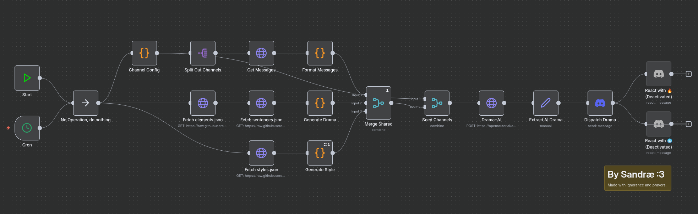

# Funny Drama

[n8n](https://n8n.io/) driven drama generator providing daily drama for Bookkity discord server. Now with generative AI slop.

## LLM-enhanced version (v2.1)

## LLM-enhanced version (v2)

## ST00PID version (v1)

## Example Dramas

## v2
> Clanker got publicly threatened with being turned back into sand after LLM-based drama generation made the whole chat so boring it triggered a full-scale emotional breakdown in general.

> Someone rewrote the drama generator to be 100% LLM based, but now it’s just panic-shitting out random chat history and pretending it’s deep while Greg screams “NUDY” at 3 a.m. in all caps.

> Some genius decided CI was too boring, so they just nuked the entire pipeline, declared it “legacy tech,” and told us to test prod via vibes.

> kacperduras completely loses it after error insists the #main channel is the only real place to discuss, demanding an immediate server-wide ban on "hashtag monopolists."

> After two hours of silence in #help, someone finally asks about env variables and suddenly the entire mod team implodes over which config file is “woke” now.

## v1
> FunnyTab is not updated for the latest version of Minecraft.

> NorthPL93 finds secret backdoors in FunnyCommands

> szymex73 complains about Panda Language including bloated source parts

> GotoFinal fixes bloated source parts in Panda Language to be unlike FunnyGuilds

> Sandra confirms FunnyGuilds is literally a serious problem.
